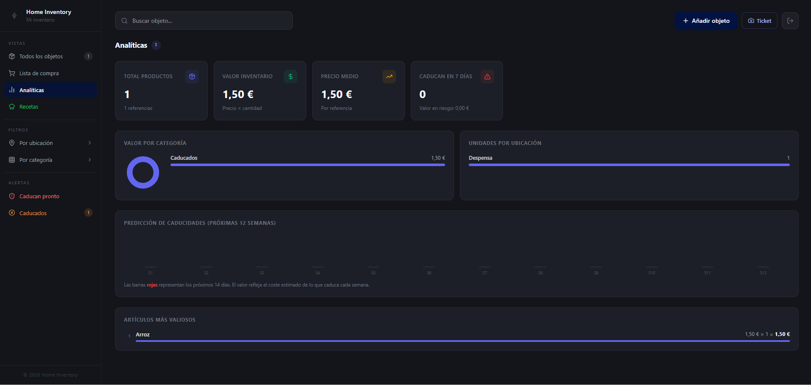
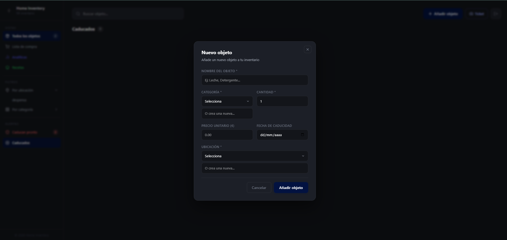

# HomeInventory

Aplicación full stack para gestionar productos almacenados en casa, con autenticación, inventario organizado y escaneo inteligente de tickets mediante IA.

🔗 Live Demo: [HomeInventory](https://homeinventoryes.vercel.app/auth)

---

## Screenshots

### Dashboard

### Gestión de inventario

### Escaneo de tickets con IA

### Autenticación

### Lista de la compra

### Añadir productos

---

## Funcionalidades

- Registro e inicio de sesión
- Protección de rutas mediante JWT
- Gestión de inventario
- Categorías y ubicaciones personalizadas
- Escaneo de tickets mediante Gemini API
- Extracción automática de información desde tickets
- Diseño responsive
- Backend REST API con Express
- Integración con Firebase

---

## Stack tecnológico

### Frontend
- React
- TypeScript
- TailwindCSS
- Vite

### Backend
- Node.js
- Express
- Firebase Admin SDK
- JWT

### IA
- Gemini API

---

## Arquitectura y aprendizajes

Este proyecto me ha permitido trabajar en:
- autenticación y protección de endpoints,
- integración frontend/backend,
- despliegue y configuración de entornos,
- estructura escalable en aplicaciones full stack,
- gestión de errores,
- e integración de IA aplicada a una funcionalidad real.

Uno de los retos más interesantes ha sido integrar Gemini para automatizar el escaneo de tickets y extracción de información dentro de la aplicación.

---

## Estado del proyecto

Proyecto en desarrollo activo.

Actualmente sigo mejorando partes relacionadas con arquitectura, seguridad y experiencia de usuario.

---

## Autor

Sergio Alberto Martínez Salmerón

🔗 [Portfolio](https://portfoliosergiomtzs.vercel.app/)
🔗 [LinkedIn](https://www.linkedin.com/in/sergiomtzs96/)
